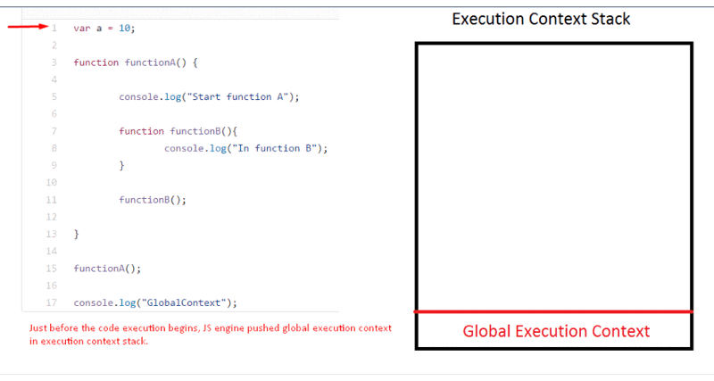

# Execution Context, Scope chain and JavaScript internals

**执行上下文(EC)** 是指JavaScript代码的执行环境.
所谓环境是指`this`的值,变量,对象,以及JS代码访问的函数等组成的环境.

JS的执行上下文共分三种:

* **全局执行上下文(GEC):** 这是浏览器加载完JS文件,开始执行JS代码时的默认执行上下文.所有的全局代码都在全局上下文执行.在浏览器环境中,如果是严格模式下执行,this的值为undefined,否则为window对象.全局上下文在JS执行环境中只有一个.
* **函数执行上下文(FEC):** 函数执行上下文是函数代码执行时创建的.每个函数都有自己的执行上下文.JS代码执行过程中,可能存在多个函数执行上下文.函数执行上下文可以访问全局执行上下文中的所有代码(变量和函数).在执行全局执行上下文中的代码时,如果JS引擎遇到了函数定义,将创建爱你一个新的函数执行上下文.
* **Eval:** eval函数的执行上下文.

并将其压入ECS中。JS引擎总是在执行ECS栈中顶部的FEC对应的函数.当函数执行结束时，JS引擎会将对应的FEC弹出栈，并继续执行栈里的下个函数。

看个例子：
```JavaScript
var a = 10;

function functionA() {
  console.log("Start function A");
  function functionB(){
    console.log("In function B");
  }
  functionB();
}

functionA();
console.log("GlobalContext");
```



如上代码一旦加载进浏览器，JS引擎就会将GEC压入ECS中。当`functionA`在GEC中被调用时，JS引擎再次将`functionA`的FEC压入ECS，并开始执行`functionA`.

当`functionB`在`functionA`的FEC中被调用时，JS引擎同样会将`functionB`的FEC压入ECS。一旦`functionB`的所有代码都执行完毕，JS引擎会弹出`functionB`的FEC。
这之后，`functionA`的FEC又出现在ECS的顶部，JS引擎继续执行`functionA`的剩余代码。

一旦`functionA`中的左右代码都执行完毕，JS引擎弹出`functionA`的FEC并继续执行GEC中的剩余代码。

当所有代码都执行完时，JS引擎弹出GEC，即JS代码的执行结束了。

到这里，我们讨论了JS引擎如何处理执行上下文。现在，我们继续看看JS引擎是如何创建执行上下文的。

JS引擎创建执行上下文要经历如下两个阶段：

* 创建阶段
* 执行阶段

创建阶段是指JS引擎已调用一个函数，但还没开始执行它。在创建阶段，JS引擎处于编译状态，它在扫描函数的代码并编译之。

在创建阶段，JS引擎完成以下任务：

* **创建活动对象(Activation object)或变量对象(Variable object)：** 活动对象是JS中的一种特殊对象，它包含了所有变量，函数参数，内部函数的声明信息。由于其特殊性，所以没有dunder proto属性。
* **创建作用域链(Scope chain)：** 活动对象创建结束后，JS引擎开始初始化作用域链，这是包含当前函数所有变量的一个列表，同时也包含了GEC的变量。
* **决定this的值：** 上一步之后，JS引擎开始初始化this的值。

用一个例子来理解这些任务：

```JavaScript
function funA (a, b) {
  var c = 3;
  var d = 2;

  d = function() {
    return a - b;
  }
}

funA(3, 2);
```

在`funA`被调用但还未开始执行前，JS引擎创建了一个如下的`executionContextObj`:

```json
executionContextObj = {
  variableObject: {}, // All the variable, arguments and inner function details of the funA
  scopechain: [], // List of all the scopes inside which the current function is
  this // Value of this
}
```

活动对象或变量对象包含参数对象，参数对象详细描述了函数接收的参数。

当前函数内定义的所有变量和内部函数都以属性的方式出现在变量对象（variableObject）中。

在我们的例子中，活动对象或变量对象的结构如下：

``` JavaScript
variableObject = {
  argumentObject : {
    0: a,
    1: b,
    length: 2
  },
  a: 3,
  b: 2
  c: undefined,
  d: undefined then pointer to the function defintion of d
}
```

1. **argumentObject**: JS引擎会按如上代码所示来创建参数对象。同时还会在argumentObject上添加一个length属性来表示函数的参数个数。
2. 现在，针对函数内定义的每一个变量，JS引擎将在variableObject上添加一个属性，并初始为undefined。因为参数也属于函数内部的变量，所以再次出现在这里。
3. 如果变量已经以参数对象的属性的形式存在的话，JS引擎将不会做任何事而是直接到下一行代码。
4. 当JS引擎在当前函数内遇到函数定义时，JS引擎会以函数名为属性名而在variableObject上添加一个属性。函数定义存储在堆内存中，而不在ECS中，以函数名为名的属性将指向堆内存中的函数定义。

所以，第一次d被声明为一个变量时得到的值为`undefined`,但当JS引擎解析到函数声明时，函数表达式赋值给了d，所以d又指向了堆中存储的函数定义。

这之后JS引擎将生成作用域链，并决定this的值。

### 执行阶段

在执行阶段，JS引擎将再次扫描整个函数代码，并更新变量对象的初始值，然后执行代码。

执行阶段结束后，variableObject看起来是这样的：

```JavaScript
variableObject = {
  argumentObject : {
    0: a,
    1: b,
    length: 2
  },
  a: 3,
  b: 2,
  c: 3,
  d: undefined then pointer to the function defintion of d
}
```

### 完成的例子:

考虑下面的代码：

```JavaScript
a = 1;

var b = 2;

cFunc = function(e) {
  var c = 10;
  var d = 15;

  a = 3

  function dFunc() {
    var f = 5;
  }

  dFunc();
}

cFunc(10);
```

浏览器加载完上述代码后，JS引擎将进入编译状态并创建执行上下文。在编译阶段，JS引擎只处理声明而不管初始值。
接下来详细看看执行上下文的创建阶段。

* **第一行:** 这一行给变量a赋值1，JS引擎不认为这是一个变量声明或函数声明语句，所以直接跳过到第3行。因为不是任何声明语句，引擎在编译阶段对这一行不做任何处理。

* **第三行:** 因为上面的代码在全局作用域，且这一行在声明一个变量，JS引擎将以变量名为名在GEC对象上创建一个属性,并初始化其值为undefined.

* **第五行:** JS引擎发现一个函数声明，它会将函数定义存储到堆内存，并添加一个属性指向函数定义处。JS引擎此刻并不管函数cFunc内部是如何定义的。

* **第18行:** 这行代码不是声明语句，所以JS引擎不做任何事。

#### 编译阶段结束后的GEC对象：

``` JavaScript
globalExecutionContextObj = {
  activationbj: {
      argumentObj : {
          length:0
      },
      b: undefined,
      cFunc: Pointer to the function definition
  },
  scopeChain: [GLobal execution context variable object],
  this: value of this
}
```

再往下没有代码了，所有JS引擎现在将进入执行阶段并再次扫描整个代码。这次将会更新变量的值并执行代码。

* **第一行:** JS 引擎发现并没有一个名为a的属性在variableObject上, 所以它在GEC上添加了新属性a并初始化它的值为1.

* **第3行:** JS引擎检在活动变量上查到有一个属性名为b,然后更新它的值为2.

* **第5行:** 因为这行是函数声明，所以引擎不做任何事并直接移植18行。

* **第18行:** 这里调用了cFunc,JS引擎再次进入编译阶段并通过扫描函数代码创建一个cFunc函数的执行上下文对象

#### 执行阶段后的GEC对象:

``` JavaScript
globalExecutionContextObj = {
  activationbj: {
      argumentObj : {
          length:0
      },
      b: 2,
      cFunc: Pointer to the function definition,
      a: 1
  },
  scopeChain: [GLobal execution context variable object],
  this: value of this
}
```

`cFunc`函数有一个参数为`e`，JS引擎会将e添加到cFunc的执行上下文对象的argumentObject上，并初始化为2.

* **第6行:** JS引擎将会检查c是否是cFunc的活动对象上的一个属性。因为并没找到，所以引擎会创建属性c并初始化为undefined.

* **第7行:** 和第6行一样

* **第9行:** 这一行不是声明，引擎将跳过

* **第11行:** JS引擎又遇到一个函数声明，同样会将该函数的定义存储在堆内存中，并创建一个属性dFunc执行堆中的函数定义。引擎此刻不管dFunc的内部实现.

* **第15行:** 这行语句不是声明，引擎忽略。

#### 编译阶段结束后的cFunc 函数的执行上下文对象(FEC)

```JavaScript
cFuncExecutionContextObj = {
  activationbj: {
      argumentObj : {
          0: e,
          length:1
      },
      e: 10,
      c: undefined,
      d: undefined
      dFunc: Pointer to the function definition,
  },
  scopeChain: [cFunc variable object, Global exection context variable object],
  this: value of this
}
```

cFunc中再无代码，JS引擎再次进入执行阶段并再次扫描执行代码。

* **第6和7行:** c 和 d 的值各自被初始化为10和15

* **第9行:** a不是cFunc函数FEC对象上有记录的额属性，且这一行不是声明语句，引擎会继续在作用域链的帮助下，在GEC上继续查找属性a. 如果没找到，引擎会在GEC上创建一个新属性a并初始化它（非严格模式下）.这里，属性a已经存在于GEC上，引擎会更新它的值为3.
在这个例子中，当引擎在当前执行上下文对象中找不到某个变量的声明时，便会向上一级（此处是全局执行上下文）继续查找。

* **第11行:** 引擎创建一个dFunc属性，并指向它在堆中的地址。

#### 执行阶段结束后的cFunc函数的FEC对象：

```JavaScript
cFuncExecutionContextObj = {
  activationbj: {
      argumentObj : {
          0: e,
          length:1
      },
      e: 10,
      c: 10,
      d: 15
      dFunc: Pointer to the function definition,
  },
  scopeChain: [cFunc variable object, Global exection context variable object],
  this: value of this
}
```

* **第15行:** 函数调用，引擎再次进入编译阶段并创建dFunc的FEC对象。

dFunc函数的FEC对象通过作用域链可以访问cFunc和全局作用域中的所有的变量和函数定义.

同样,cFunc可以访问全局作用域中的所有变量和对象，但不能访问dFunc中的变量和对象。

GEC不能访问cFunc和dFunc中的变量或对象。

通过上面的概念，应该很容易理解JS中的hoisting.

### 作用域链:

作用域链是当前函数中的所有函数的variableObjects的列表.作用域链同时构成了当前函数的FEC对象。

#### Consider the below code:

```JavaScript
a = 1;

var b = 2;

cFunc = function(e) {
  var c = 10;
  var d = 15;

  console.log(c);
  console.log(a);

  function dFunc() {
    var f = 5;
    console.log(f)
    console.log(c);
    console.log(a);
  }

  dFunc();
}

cFunc(10);
```

当函数cFunc在全局作用域被调用时，cFunc的作用域链看来如下：

```
Scope chain of cFunc = [  cFunc variable object,
                          Global Execution Context variable object ]
```

当函数dFunc在cFunc中被调用时，因为dFunc在cFunc内部,dFunc的作用域链由dFunc函数内部的变量对象，cFunc函数内部的变量对象以及全局作用域下的变量对象组成。

```
Scope chain of dFunc = [  dFunc variable object,
                          cFunc variable object,
                          Global Execution Context variable object ]
```

当在dFunc中的访问f时，引擎检查到f在dFunc的变量对象中是可访问的。然后执行代码在控制台中输出f的值。

当在dFunc中访问c时，引擎会现在dFunc的变量对象中检查c是否可访问。如果没有找到，引擎将会继续在cFunc中查找。

因为变量c在dFunc的变量对象中没有找到，引擎继续在cFunc的变量对象中查找，并找到了，然后执行代码在控制台中输出c的值。

当试图在dFunc函数中输出a的值时，引擎会依次在dFunc的变量对象，cFunc的变量对象以及全局执行上下文的变量对象中查找a，并最终在GEC的变量对象中找到，然后打印之。

同样的，在cFunc中，引擎将在GEC的变量对象中找到变量a的声明。

cFunc中无法访问变量f，但dFunc可以访问c和d

闭包也可以用作用域链来解释。


译注：没有仔细研究过各浏览器的引擎实现，本文有关引擎对执行上下问和作用域链的操作，可理解为理想操作模型，实际各浏览器引擎的实现可能未必如此。

