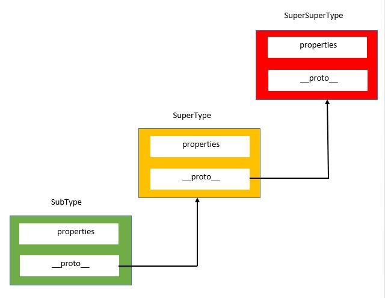
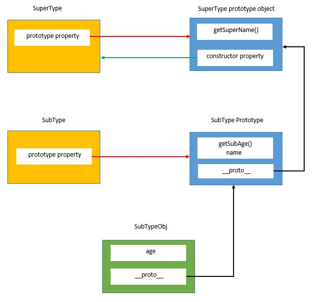
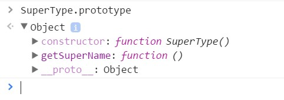
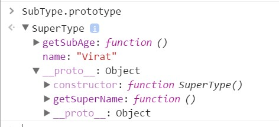
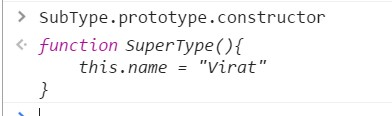
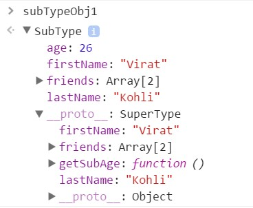

#JS中的继承

## 原型链

JS不像其他语言,没有`class`(ES6 和 TS 引入了 `class`关键字). 它使用原型的概念来实现继承.
原型链是指对象的dunder proto(`\_\_proto\_\_`)指向另一个对象,而不是指向构造器的原型,并且这种解构循环下去就是一条链.



来个例子

```javascript
//SuperType constructor function
function SuperType(){
	this.name = "Virat"
}

//SuperType prototype
SuperType.prototype.getSuperName = function(){
	return this.name
}

//SubType prototype function
function SubType(){
	this.age = 26
}

//Inherit the properties from SuperType
SubType.prototype = new SuperType();

//Add new property to SubType prototype
SubType.prototype.getSubAge = function(){
	return this.age;
}

//Create a SubType object
var subTypeObj = new SubType();
console.log(subTypeObj.name); //Output: Virat
console.log(subTypeObj.age); //Output: 26
console.log(subTypeObj.getSuperName()); //Output: Virat
console.log(subTypeObj.getSubAge()); //Output: 26
```

上述代码定义了两个构造器,`SuperType`和`SubType`.
默认情况下,`SubType.prototype`有一个属性为`constructor`,指向构造器函数本身,以及一个`dunder proto`属性指向所继承的对象.

```javascript
//Inherit the properties from SuperType
SubType.prototype = new SuperType();
```

这一行代码修改了`SubType`的默认原型对象,让其指向了一个由`SuperType`构造器生成的对象.
这意味着`SupertType`的实例拥有的属性和方法,现在`SubType`的原型都有了,即现在`SubType`可以访问任意的`SuperType`的属性和方法.

```javascript
//Add new property to SubType prototype
SubType.prototype.getSubAge = function(){
	return this.age;
}
```

修改了`SubType`的prototype后,上述代码又给其添加了新的方法`getSubAge()`

**注意**给`SubType`的新方法必须在完成继承操作之后添加,因为继承操作会覆盖其原型.



#### Console Output
>SuperType.prototype



>SubType prototype

 

>SubType constructor



**注意**: `getSuperName()`方法依旧来自`SuperType`的原型上,但属性`name`来自`SubType`的原型.这是因为`getSuperName()`是一个原型上的方法,
而属性`name`是实例上的属性.`SubType`的原型时`SuperType`的一个实例,所以属性`name`来自这里.
同时注意到,`SubType`原型上的constructor指向了`SuperType`,这是因为其constructor属性在继承时被覆盖了.

#### 原型链存在的问题

`SuperType`原型上的所有属性被其子对象所共享,如果有一个子对象修改了其中的属性值,其他子对象也会被影响.

[here](./Prototypes.md)

为避免这个问题,可以使用构造器来继承实例属性,使用原型链来继承共享的方法和属性.

```javascript
//SuperType constructor function
function SuperType(firstName, lastName){
	this.firstName = firstName || "Virat",
	this.lastName = lastName || "Kohli",
	this.friends = ["Ashwin", "Jadeja"]
}

//SuperType prototype
SuperType.prototype.getSuperName = function(){
	return this.firstName + " " + this.lastName;
}

//SubType prototype function
function SubType(firstName, lastName, age){
	//Inherit instance properties
	SuperType.call(this, firstname, lastName);
	this.age = age;
}

//Inherit methods and shared properties
SubType.prototype = new SuperType();

//Add new property to SubType prototype
SubType.prototype.getSubAge = function(){
	return this.age;
}

//Create SubType objects
var subTypeObj1= new SubType("Virat", "Kohli", 26);
var subTypeObj2 = new SubType("Sachin", "Tendulkar", 39);

//Modify the friends property using the subTypeObj1
subTypeObj1.friends.push("Amit");

console.log(subTypeObj1.friends);//["Ahswin", "Jadega", "Amit"]
console.log(subTypeObj2.friends);//["Ashwin", "Jadega"]

//subTypeObj1
console.log(subTypeObj1.firstName); //Output: Virat
console.log(subTypeObj1.age); //Output: 26
console.log(subTypeObj1.getSuperName()); //Output: Virat Kohli
console.log(subTypeObj1.getSubAge()); //Output: 26

//subTypeObj2
console.log(subTypeObj2.firstName); //Output: Sachin
console.log(subTypeObj2.age); //Output: 39
console.log(subTypeObj2.getSuperName()); //Output: Sachin Tendulkar
console.log(subTypeObj2.getSubAge()); //Output: 39
```
来看看上面的代码,上面定义了一个`SuperType`构造器,其拥有`firstName`,`lastName`和`friends`三个实例属性.
然后在`SuperType`的原型上定义了一个`getSuperName`属性

接下来是`SubType`构造器的定义

```javascript
//SubType prototype function
function SubType(firstName, lastName, age){
	//Inherit instance properties
	SuperType.call(this, firstname, lastName);
	this.age = age;
}
```
这里,在`SubType`构造器的定义中,使用了`call`方法显式地调用了`SupertType`构造器.
`call`方法会将`SuperType`的属性copy到`SubType`的实例上.
之后又在`SubType`构造器里添加了新属性`age`.

```javascript
//Inherit methods and shared properties
SubType.prototype = new SuperType();
```

到这里,已经将`SuperType`构造器上的所有实例属性都已继承,但是共享的属性和方法还没有继承,上面这行代码就是来完成这件事的.

执行完上面这行代码,我们就完成了对`SuperType`的所有属性的继承.

```javascript
//Add new property to SubType prototype
SubType.prototype.getSubAge = function(){
	return this.age;
}
```

这行代码给`SubType`又添加了一个新方法

接下来通过创建一个`SubType`的实例,来看看上面这整个过程都做了些什么

```javascript
var subTypeObj1= new SubType("Virat", "Kohli", 26);
```

执行上面这行代码,三个参数('Virat', 'Kohli', 26)传给了`SubType`构造器.`SubType`构造器通过执行`SuperType.call(this, firstName, lastName)`这行代码,调用了`SuperType`构造器
这里的`this`指代`subTypeObj1`

这里`SuperType`构造器的执行上下文是`subTypeObj1`,属性`firstName`,`lastName`,`friends`添加给了`subTypeObj1`对象.
这之后,`SubType`构造器又给`subTypeObject1`添加了新属性`age`.

>Thus as of now there are properties with the *subTypeObj1* object (firstName, lastName and age).
Currently SubType constructor function has following methods and shared propertes in its prototype property:
1. getSuperName()
2. getSubAge

至此,`subTypeObj1`对象拥有了属性`firstName`,`lastName`和`age`.
构造器`SubType`的原型对象有了如下方法和共享属性.

看看`subTypeObj1`对象的结构:

```javascript
console.log(subTypeObj1)
```

>Console output


