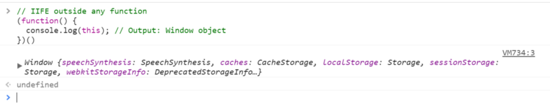
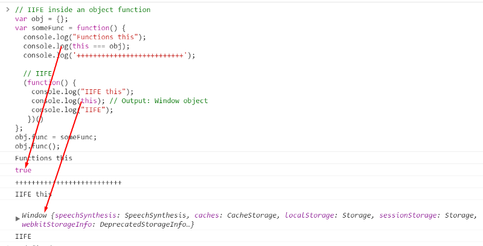
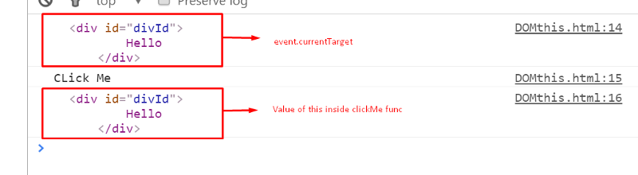

# this

>In most cases, the value of this is determined by how a function is called. 
>It can't be set by assignment during execution, and it may be different each time the function is called
>You can change the this context through .call(), .apply() and .bind()
>Value of *this* is equal to the value of the object which invokes the function
>*this* is not assigned a value until an object invokes the function where *this* is defined

大多数时候,this的值由函数的调用者来决定.
运行时不可能通过赋值操作修改this的值,而且不同时刻对同一个函数的调用,其中的this所指也可能不同.
可以通过调用函数的`call()`,`apply()`和`bind()`方法来修改this的指向.
this的值始终指向调用函数的对象.


### Global Context
### 全局上下文

>When functions are executed in the global scope, value of *this* is *windows* boject
>In strict mode, value of *this* in the global context will undefined.
>Consider the below example:

当函数在全局作用域执行时,this指向window对象.
在严格模式下,全局作用域下的this为undefined.
看看如下例子:

```javascript
var myFunciton = function(){
  console.log(this);
  console.log(this=== window);
}

myFunction();// Output: Window object. In strict mode value will be undefined 
```

>The above function was not executed inside any other function or object hence, by default the myFunction was called on the global oject
>Hence the value of this is 'window'. In strict, value would be undefined.

上述函数的执行不在任何函数或对象内,所以默认情况下myFunciton是在全局作用域下被执行.
所以输出显示this指向window,在严格模式下,是undefined.


In strict mode, value of this will be undefined


### As an object method
### 作为对象的方法时

>When a function is called as a method of an object, its this is set to the object the method is called on.

当函数以某个对象方法的身份执行时,this指向这个对象.

To understand this, consider the below example:

为了理解这个说法,看看下个例子:

```javascript
var val = 37;
var myObj = {
	val : 10,
	someFunction : function(){
		console.log(this.val);//Output: 10 since tha value of this is equal to myObj
		console.log(window.val); //Output: 37
		console.log(this === myObj) // true
		console.log(this)//Output: myObj object
	}
}

myObj.someFunction();
```
#### Console output:


> Let's consider an another example to understand *this*

再看一个例子:

```javascript
//Variable defined in global scope
var val = 37;

var myObj = {
	val : 10
}

var someFunction = function(){
		console.log(this.val);
		console.log(window.val);
		console.log(this === myObj);
		console.log(this);
		console.log(this === window) 
}

myObj.objectFunc = someFunction;
myObj.objectFunc();  
/*
Output:
	1. 10
	2. 37
	3. true
	4. myObj
	5. false
*/

someFunction();
/*
Output:
	1. 37
	2. 37
	3. false
	4. window
	5. true
*/
```
> In the above example, first we call someFunction() in the context of myObj. 
>Later we called the function in the global context. This shows that the value of *this* was determined dynamically 
>on the basis of execution context.

上面这个例子,第一次`someFunction`是以`myObj`的方法的身份执行的,然后,又在全局上下文执行了一次.
结果显示同一个函数的`this`的值是由运行时的执行上下文动态决定的.

### As a constructor
### 作为构造器时

>When a function is used as a constructor (with the new keyword), its *this* is bound to the new object being constructed.

当一个函数作为构造器时(使用new关键字调用时),`this`指向它将要构造的新对象.

```JavsScript

function ConstructorFunc(value){
	this.someValue = value;
}

var obj1 = new ConstructorFunction(20);
console.log(obj1.someValue)//Output: 20
```


> Here, we have defined ConstructorFunc to create new objects.
> When `var obj1 = new ConstructorFunction(20)` is executed, value of this will be equal to the new object that is created.

这里,我们定义了`ConstructorFunc`,并创建了一个对象.执行new语句时,this将指向新创建的对象.

### in Immediately Invoked Function expression (IIFE)
### 在立即执行函数中(IIFE)

> In IIFE, value of this is always equal to Window object. Let’s see an example:

在立即执行函数中,this始终指向window对象,看个例子:

```JavaScript
// IIFE outside any function 
(function() {
  console.log(this); // Output: Window object
})()


// IIFE inside an object function
var obj = {};

var someFunc = function() {
  console.log("Functions this");
  console.log(this === obj);
  console.log('++++++++++++++++++++++++++');
  
  // IIFE 
  (function() {
    console.log("IIFE this");
    console.log(this); // Output: Window object
    console.log("IIFE");
   })()
};

obj.func = someFunc;

obj.func();
```

#### Console Output


> In the first example, IIFE outside any function, value of this inside IIFE will be Window object.

在第一个例子中,IIFF不在任何函数中,其中的this指向window对象.



> In the second example, when we have called IIFE inside someFunc still the value of this is Window object not obj object.

这一次,IIFE函数的定义位于`someFunc`中,this依然指向window对象.

> This is because, value of this inside a function is equal to the object on which it is called.
> someFunc is called on obj, hence value of this inside someFunc is obj.
> But, IIFE is self invoked, it has not been called by any object. Hence, the value of this inside IIFE is Window object.

这是因为函数中this的值由调用它的对象决定的.`someFunc`被`obj`调用,所以其中的this指向`obj`.
而IIFE时自调用,它没有被任何对象调用.所以它的this指向window对象.

### Event handler in JavaScript
### 在事件回调中

> Inside event handler, value of this is equal to the element on which the event is fired. Let’s see this with an example of click event.

在事件回调中,`this`的值等于触发事件的元素对象.看个例子:

```html
<!DOCTYPE html>
<html>
<head>
	<title></title>
</head>
<body>
	<div id="divId">
		Hello
	</div>
	<script type="text/javascript">
		var id = document.getElementById('divId').addEventListener('click', clickMe, false);
		function clickMe(event) {
			console.log(event.currentTarget);
			console.log("CLick Me");
			console.log(this);
		}
	</script>
</body>
</html>
```

> In the above example, we have added an on click event handler on the div element which calls the clickMe function.

上面这个例子中,`div`元素添加了click事件的监听,回调`clickMe`函数.



> When we click on the div, from the above console output we can see that value of this is equal to the div element which we clicked.

当点击`div`时,从上面的控制台输出可以看出,this指向了点击的`div`元素.

> We can change the value of this at run time using call, apply and bind function. We will discuss call, apply and bind in another article.

this的值在运行时可以通过`call`,`apply`和`bind`函数改变.这将在其他文章里讨论.
