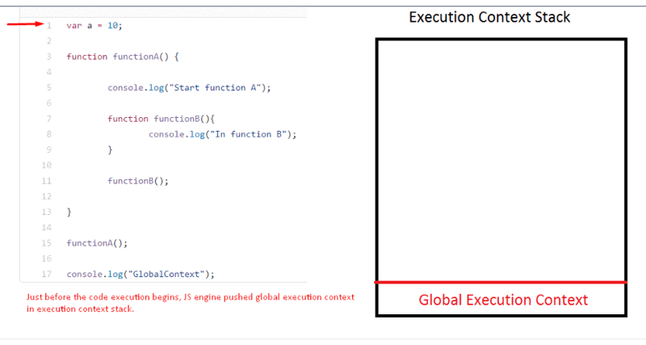

# Execution Context, Scope chain and JavaScript internals

> **Execution context (EC)** is defined as the environment in which JavaScript code is executed.
> By environment I mean the value of this, variables, objects, and functions JavaScript code has access to, constitutes it’s environment.

**执行上下文(EC)** 是指JavaScript代码的执行环境.
所谓环境是指`this`的值,变量,对象,以及JS代码访问的函数等组成的环境.

> Execution context in JavaScript are of three types:

JS的执行上下文共分三种:

* **Global execution context (GEC):** This is the default execution context in which JS code start it’s execution when the file first loads in the browser. All the global code are executed inside global execution context. In the browser context, if the code is executing in strict mode value of this is undefined else it is window object. Global execution context cannot be more than one because only one global environment is possible for JS code execution.
* **Functional execution context (FEC):** Functional execution context is defined as the context created by the execution of code inside a function. Each function has it’s own execution context. It can be more than one. Functional execution context have access to all the code of global execution context. While executing global execution context code, if JS engine finds a function call, it creates a new functional execution context for that function.
* **Eval:** Execution context inside eval function.

* **全局执行上下文(GEC):** 这是浏览器加载完JS文件,开始执行JS代码时的默认执行上下文.所有的全局代码都在全局上下文执行.在浏览器环境中,如果是严格模式下执行,this的值为undefined,否则为window对象.全局上下文在JS执行环境中只有一个.
* **函数执行上下文(FEC):** 函数执行上下文是函数代码执行时创建的.每个函数都有自己的执行上下文.JS代码执行过程中,可能存在多个函数执行上下文.函数执行上下文可以访问全局执行上下文中的所有代码(变量和函数).在执行全局执行上下文中的代码时,如果JS引擎遇到了函数定义,将创建爱你一个新的函数执行上下文.
* **Eval:** eval函数的执行上下文.

> Execution context stack (ECS): Execution context stack is a stack data structure to store all the execution stacks created while executing the JS code. Global execution context is present by default in execution context stack and it is at the bottom of the stack. While executing global execution context code, if JS engines finds a function call, it creates functional execution context of that function and pushes that function execution context on top of execution context stack. JS engine executes the function whose execution context is at the top of the execution context stack. Once all the code of the function is executed, JS engines pop’s out that function’s execution context and start’s executing the function which is below it.

**执行上下文栈(ECS):** 执行上下文栈是一个栈数据结构，用来存储JS代码执行过程中的所有执行上下文.
GEC默认出现在ECS中，且在栈的底部.当运行GEC中的代码是，如果JS引擎遇到了函数调用，它将创建一个用于该函数的FEC，
并将其压入ECS中。JS引擎总是在执行ECS栈中顶部的FEC对应的函数.当函数执行结束时，JS引擎会将对应的FEC弹出栈，并继续执行栈里的下个函数。

> Let’s understand this with the help of an example:

看个例子：
```JavaScript
var a = 10;

function functionA() {
	console.log("Start function A");
	function functionB(){
		console.log("In function B");
	}
	functionB();
}

functionA();
console.log("GlobalContext");
```


